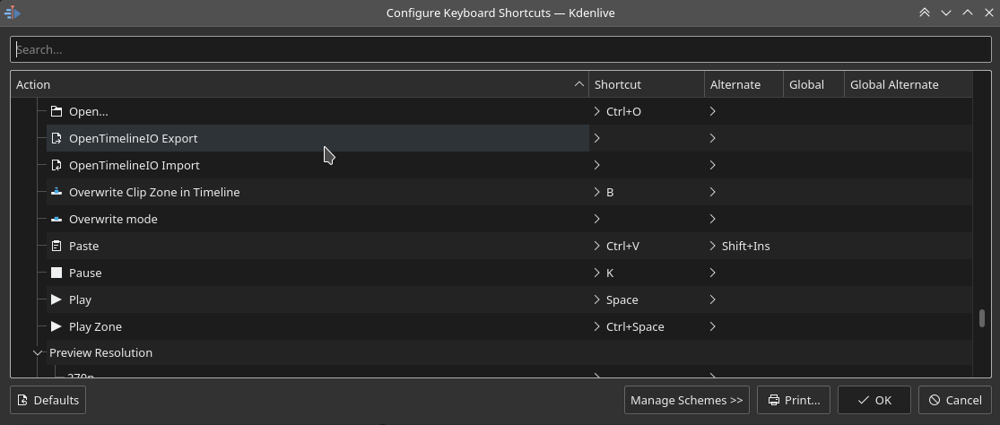

.. meta::
   :description: Kdenlive's User Interface - Default Keyboard Shortcuts
   :keywords: KDE, Kdenlive, shortcuts, set, documentation, user manual, video editor, open source, free, learn, easy, user interface, keyboard, shortcuts

.. metadata-placeholder

   :authors: - Annew (https://userbase.kde.org/User:Annew)
             - Claus Christensen
             - Yuri Chornoivan
             - Simon Eugster <simon.eu@gmail.com>
             - Ttguy (https://userbase.kde.org/User:Ttguy)
             - Thanks4theFish (https://userbase.kde.org/User:Thanks4theFish)
             - Bushuev (https://userbase.kde.org/User:Bushuev)
             - Eugen Mohr
             - Bernd Jordan (https://discuss.kde.org/u/berndmj)

   :license: Creative Commons License SA 4.0

.. |kde_store| raw:: html

   <a href="https://store.kde.org/browse?cat=426&ord=latest" target="_blank">KDE Store</a>

.. _ui-keyboard_shortcuts:

Keyboard Shortcuts
==================

..
   The base EXCEL "Shortcuts_for_Kdenlive.xlsx" is stored in folder "files"

   ## Approach with +----+----+ table approach ##

   Copy/paste from EXCEL sheet direct into the online converter.
   Grid tables online converter: https://www.tablesgenerator.com/text_tables
   On top of the converter click on tab "text"
   On the bottom set "to reStructuredText syntax". Now the table header line is bold.

   ## Alternative approach with '.. list-table::' directive ##

   IN the EXCEL sheet, filter the data by shortcut category (e.g. File) and select the cells in column H. Then copy from the spreadsheet and paste it into the .rst file. Some manual adjustments are needed for proper formatting of the display due to LibreOffice Calc losing some of the formatting (e.g. leading spaces or turning LF into space). OnlyOffice does not have that problem.

   Since list-table does not allow for LF in cells you need to use | to force a LF (see line 95ff below)

Kdenlive has many keyboard shortcuts already defined by default. You can change these anytime through :menuselection:`Menu --> Settings --> Configure keyboard shortcuts` or by pressing :kbd:`Ctrl+Alt+,` . See also the :ref:`configure_shortcuts` chapter.

You can also download keyboard shortcut definition files (aka Kdenlive Keyboard Schemes) from the |kde_store|.  See also the :ref:`useful_resources` chapter.

.. _ui-shortcuts_file:

File 
----
.. list-table::
   :width: 100%
   :widths: 25 25 50
   :header-rows: 1
   :class: table-wrap

   * - Action Name
     - Shortcuts
     - Description
   * - New
     - :kbd:`Ctrl+N`
     - Creates a new Kdenlive project
   * - Open...
     - :kbd:`Ctrl+O`
     - Opens a Kdenlive project
   * - Quit
     - :kbd:`Ctrl+Q`
     - Exits Kdenlive
   * - Save
     - :kbd:`Ctrl+S`
     - Saves the current state of the project
   * - Save As...
     - :kbd:`Ctrl+Shift+S`
     - Saves the current state of the project with the name of your choice

.. _ui-shortcuts_general:

General
-------
.. list-table::
   :width: 100%
   :widths: 25 25 50
   :header-rows: 1
   :class: table-wrap

   * - Action Name
     - Shortcuts
     - Description
   * - Collapse/Expand Item
     - :kbd:`<`
     -
   * - Copy
     - | :kbd:`Ctrl+C` or
       | :kbd:`Ctrl+Ins`
     - Current selection
   * - Delete Selected Item
     - :kbd:`Del`
     -
   * - Find Action…
     - :kbd:`Ctrl+Alt+I`
     - Opens the action window. Only possible with this shortcut.
   * - Full Screen Mode
     - :kbd:`Ctrl+Shift+F`
     -
   * - Kdenlive Handbook
     - :kbd:`F1`
     -
   * - Switch Monitor Fullscreen
     - :kbd:`F11`
     - Monitor
   * - Paste
     - | :kbd:`Ctrl+V` or
       | :kbd:`Shift+Ins`
     -
   * - Redo
     - :kbd:`Ctrl+Shift+Z`
     -
   * - Rename...
     - :kbd:`F2`
     -
   * - Show Menu Bar
     - :kbd:`Ctrl+M`
     - | Show :ref:`Menu Bar <toolbars>`
       | Shows the menu bar again after it has been hidden
   * - Select All
     - :kbd:`Ctrl+A`
     - Works in:

       - :term:`Timeline`
       - :term:`Project Bin`
       - Titler
   * - Undo
     - :kbd:`Ctrl+Z`
     -
   * - Up
     - :kbd:`Alt+Up`
     -
   * - What's This?
     - :kbd:`Shift+F1`
     -
   * - Zoom In
     - :kbd:`Ctrl++`
     - Works in Timeline only
   * - Zoom In
     - | :kbd:`Ctrl+=` or
       | :kbd:`Ctrl+Mouse wheel`
     - Works in:

       - :term:`Timeline`
       - :term:`Clip Monitor`
       - :term:`Project Monitor`
       - :term:`Project Bin`
       - Effects keyframe panel
   * - Zoom Out
     - :kbd:`Ctrl+-`
     - Works in Timeline only
   * - Zoom Out
     - :kbd:`Ctrl+Mouse wheel`
     - Works in:

       - Timeline
       - Clip Monitor
       - Project Monitor
       - Project Bin
       - Effects keyframe panel
   * - Increment, Decrement
     - :kbd:`Mouse wheel`
     - Works in:

       - Timeline: scroll the timeline left/right
       - Timeline Ruler
       - Project and Clip Monitor
       - Project Bin
       - Effects keyframe pane, numbers and selections
   * - Add to the selection
     - | :kbd:`Shift+left click`
       | :kbd:`Shift+dragging`
     - Works in:

       - Timeline: adds clicked clips to the selection
       - Timeline: adds multiple clips to the selection
       - Titler: adds clicked clips to the selection
       - Project Bin: adds all clips between already selected clip and clicked clip
   * - Add to the selection
     - :kbd:`Ctrl+left click`
     - Works in:

       - Project Bin: adds clicked clips to the selection
       - Effect: select keyframes
   * - Double click
     -
     - Works in:

       - Edit bookmark
       - Project Bin: on a clip shows properties
       - Project Bin: on an empty place opens `add clip or folder`
       - Timeline: on a clip shows duration
       - Timeline: into an empty part of a track makes the track active
       - Monitor: opens monitor in a second monitor (if installed) in fullscreen mode

.. _ui-shortcuts_nav+playback:

Navigation and Playback
-----------------------
.. list-table::
   :width: 100%
   :widths: 25 25 50
   :header-rows: 1
   :class: table-wrap

   * - Action Name
     - Shortcuts
     - Description
   * - Align Playhead to Mouse Position
     - :kbd:`P`
     - Timeline
   * - Forward
     - :kbd:`L`
     - Playback; press it again to cycle through the playback speeds (1x, 1.5x, 2x, 3x, 5.5x, 10x)
   * - Forward 1 Frame
     - :kbd:`Right`
     - Playback
   * - Forward 1 Second
     - :kbd:`Shift+Right`
     - Playback
   * - Go to Clip End
     - :kbd:`End`
     - Timeline
   * - Go to Clip Start
     - :kbd:`Home`
     - Timeline
   * - Go to Next Guide
     - :kbd:`Ctrl+Right`
     - Timeline
   * - Go to Next Snap Point
     - :kbd:`Alt+Right`
     - Timeline
   * - Go to Previous Guide
     - :kbd:`Ctrl+Left`
     - Timeline
   * - Go to Previous Snap Point
     - :kbd:`Alt+Left`
     - Timeline
   * - Go to Project End
     - :kbd:`Ctrl+End`
     - Timeline
   * - Go to Project Start
     - :kbd:`Ctrl+Home`
     - Timeline
   * - Go to Zone End
     - :kbd:`Shift+O`
     - Timeline
   * - Go to Zone Start
     - :kbd:`Shift+I`
     - Timeline
   * - Loop Zone
     - :kbd:`Ctrl+Shift+Space`
     - Playback
   * - Pause
     - :kbd:`K`
     - Playback
   * - Play / Stop
     - :kbd:`Space`
     - Playback
   * - Play Zone
     - :kbd:`Ctrl+Space`
     - Playback
   * - Rewind
     - :kbd:`J`
     - Playback; press it again to cycle through the playback speeds (-1x, -1.5x, -2x, -3x, -5.5x, -10x)
   * - Rewind 1 Frame
     - :kbd:`Left`
     - Playback
   * - Rewind 1 Second
     - :kbd:`Shift+Left`
     - Playback
   * - Playback clip
     - :kbd:`Shift` and move the mouse left/right
     - Inside the clip monitor

.. _ui-shortcuts_project_bin:

Project Bin
-----------

.. list-table::
   :width: 100%
   :widths: 25 25 50
   :header-rows: 1
   :class: table-wrap

   * - Action Name
     - Shortcuts
     - Description
   * - Closing the extra bins
     - :kbd:`CTRL+w`
     -

.. _ui-shortcuts_editing:

Editing
-------

.. list-table::
   :width: 100%
   :widths: 25 25 50
   :header-rows: 1
   :class: table-wrap

   * - Action Name
     - Shortcuts
     - Description
   * - Focus Timecode
     - :kbd:`=`
     -
   * - Insert Zone in Project Bin
     - :kbd:`Ctrl+I`
     - Clip monitor
   * - Set Zone In
     - :kbd:`I`
     -
   * - Set Zone Out
     - :kbd:`O`
     -
   * - Adjust timeline zone
     - :kbd:`Shift+z`
     - Adjusts timeline zone to selected clips
   * - Switch Monitor
     - :kbd:`T`
     - Switch between clip monitor and project monitor (timeline)
   * - Select Target 1
     - :kbd:`Ctrl+1`
     - 3-point-editing
   * - Select Target 2
     - :kbd:`Ctrl+2`
     - 3-point-editing
   * - Select Target 3
     - :kbd:`Ctrl+3`
     - 3-point-editing
   * - Select Target 4
     - :kbd:`Ctrl+4`
     - 3-point-editing
   * - Select Target 5
     - :kbd:`Ctrl+5`
     - 3-point-editing
   * - Select Target 6
     - :kbd:`Ctrl+6`
     - 3-point-editing
   * - Select Target 7
     - :kbd:`Ctrl+7`
     - 3-point-editing
   * - Select Target 8
     - :kbd:`Ctrl+8`
     - 3-point-editing
   * - Select Target 9
     - :kbd:`Ctrl+9`
     - 3-point-editing
   * - Switch All Tracks Active
     - :kbd:`Alt+Shift+A`
     - 3-point-editing
   * - Toggle All Track Lock
     - :kbd:`Ctrl+Shift+L`
     - Tracks
   * - Toggle All Tracks Active
     - :kbd:`Shift+A`
     - 3-point-editing
   * - Toggle Track Active
     - :kbd:`A`
     - 3-point-editing Activate the track as a target with shortcut :kbd:`A` (this connects the track to the source)
   * - Slip multiple clips at once
     - :kbd:`Shift+move`
     - select all clips you want to slip with the selection tool using :kbd:`Shift` then enable the slip tool and go ahead…
   * - Slip a clip
     - :kbd:`left/right`
     - Slip can be done with the mouse, with the :kbd:`left/right` keys and with the buttons on the monitor toolbar.

.. _ui-shortcuts_timeline:

Timeline
--------

.. list-table::
   :width: 100%
   :widths: 25 25 50
   :header-rows: 1
   :class: table-wrap

   * - Action Name
     - Shortcuts
     - Description
   * - Add Clip to Selection
     - :kbd:`Alt++`
     - Adds the clip of the active track to the selection at playhead position.
   * - Add Marker/Guide quickly
     - :kbd:`Num+*`
     - On Numlock pad: :kbd:`*` adds a marker/guide
   * - Add Subtitle
     - :kbd:`Shift+S`
     - Adds a subtitle at playhead position.
   * - Add Transition to Selection
     - :kbd:`Alt+Shift+ +`
     -
   * - Add/Remove Guide
     - :kbd:`G`
     - Adds a guide at playhead position.
   * - Group Clips
     - :kbd:`Ctrl+G`
     - Current selection
   * - Ungroup Clips
     - :kbd:`Ctrl+Shift+G`
     - Current selection
   * - Edit Grouped Clips
     - :kbd:`Ctrl+click`
     - Current selection
   * - Cut All Clips
     - :kbd:`Ctrl+Shift+R`
     - Cuts all clips at playhead position. Except tracks which are locked.
   * - Cut Clip
     - :kbd:`Shift+R`
     - Cuts the clip of the active track at playhead position.
   * - Deselect Clip
     - :kbd:`-`
     -
   * - Deselect Transition
     - :kbd:`Shift+-`
     -
   * - Extract Timeline Zone
     - :kbd:`Shift+X`
     -
   * - Grab Current Item
     - :kbd:`Shift+G`
     - Select a clip -> :kbd:`Shift+G` -> move the clip with :kbd:`left/right`
   * - Insert Clip Zone in Timeline
     - :kbd:`V`
     -
   * - Lift Timeline Zone
     - :kbd:`Z`
     -
   * - Mix Clips
     - :kbd:`U`
     - Or double click. Play head must be on the end/begin of 2 clips. Creates a transition between 2 clips on the same track.
   * - Extract Clip
     - :kbd:`Shift+Del`
     - Deletes the clip from the Timeline and removes the gap
   * - Multitrack View
     - :kbd:`F12`
     - :menuselection:`Tool -> Multicam tool` must be disabled
   * - Overwrite Clip Zone in Timeline
     - :kbd:`B`
     -
   * - Resize Item End
     - :kbd:`)`
     - | On active track: Cut the clip at the playhead position and delete the remainder.
       | On active track: Cut, delete and remove the empty space use :ref:`ripple_trim_to_playhead`.
   * - Resize Item Start
     - :kbd:`(`
     - | On active track: Cut the clip at the playhead position and delete the section from the start of the clip to the playhead.
       | On active track: Cut, delete and remove the empty space use :ref:`ripple_trim_to_playhead`.   
   * - Select Clip
     - :kbd:`+`
     -
   * - Select Transition
     - :kbd:`Shift+ +`
     -
   * - Start Preview Render
     - :kbd:`Shift+Return`
     -
   * - Razor Tool
     - :kbd:`X`
     - Tools
   * - Selection Tool
     - :kbd:`S`
     - Tools
   * - Spacer Tool
     - :kbd:`M`
     - Tools
   * - Deselect
     - :kbd:`Ctrl+Shift+A`
     - Tracks
   * - Select Audio Track 1
     - :kbd:`Alt+1`
     - Tracks
   * - Select Audio Track 2
     - :kbd:`Alt+2`
     - Tracks
   * - Select Audio Track 3
     - :kbd:`Alt+3`
     - Tracks
   * - Select Audio Track 4
     - :kbd:`Alt+4`
     - Tracks
   * - Select Audio Track 5
     - :kbd:`Alt+5`
     - Tracks
   * - Select Audio Track 6
     - :kbd:`Alt+6`
     - Tracks
   * - Select Audio Track 7
     - :kbd:`Alt+7`
     - Tracks
   * - Select Audio Track 8
     - :kbd:`Alt+8`
     - Tracks
   * - Select Audio Track 9
     - :kbd:`Alt+9`
     - Tracks
   * - Select Video Track 1
     - :kbd:`1`
     - | Track selection in general and for 3-point-editing
       | Multicam tool: You trim the clips in the desired track while the timeline is playing
   * - Select Video Track 2
     - :kbd:`2`
     - | Track selection in general and for 3-point-editing
       | Multicam tool: You trim the clips in the desired track while the timeline is playing
   * - Select Video Track 3
     - :kbd:`3`
     - | Track selection in general and for 3-point-editing
       | Multicam tool: You trim the clips in the desired track while the timeline is playing
   * - Select Video Track 4
     - :kbd:`4`
     - | Track selection in general and for 3-point-editing
       | Multicam tool: You trim the clips in the desired track while the timeline is playing
   * - Select Video Track 5
     - :kbd:`5`
     - | Track selection in general and for 3-point-editing
       | Multicam tool: You trim the clips in the desired track while the timeline is playing
   * - Select Video Track 6
     - :kbd:`6`
     - | Track selection in general and for 3-point-editing
       | Multicam tool: You trim the clips in the desired track while the timeline is playing
   * - Select Video Track 7
     - :kbd:`7`
     - | Track selection in general and for 3-point-editing
       | Multicam tool: You trim the clips in the desired track while the timeline is playing
   * - Select Video Track 8
     - :kbd:`8`
     - | Track selection in general and for 3-point-editing
       | Multicam tool: You trim the clips in the desired track while the timeline is playing
   * - Select Video Track 9
     - :kbd:`9`
     - | Track selection in general and for 3-point-editing
       | Multicam tool: You trim the clips in the desired track while the timeline is playing
   * - Switch Track Target Audio Stream
     - :kbd:`'`
     - Tracks
   * - Toggle Track Disabled
     - :kbd:`Shift+H`
     - Tracks
   * - Toggle Track Lock
     - :kbd:`Shift+L`
     - Tracks
   * - Toggle Track Target
     - :kbd:`Shift+T`
     - | 3-point-editing
       | Select a video or audio track in the timeline (up/down arrow key) and set it as source with :kbd:`Shift + T`.
   * - Resize only audio or video part of a clip
     - :kbd:`Shift+resize`
     - Only possible with keyboard
   * - Move audio or video part to another track independently.
     - :kbd:`Alt+move`
     - Only possible with keyboard
   * - Adjust the speed of a clip
     - :kbd:`Ctrl+dragging`
     - Only possible with keyboard
   * - Return from any tools back to Selection tool.
     - :kbd:`ESC`
     - Only possible with keyboard
   * - Tracks resized simultaneously
     - :kbd:`Shift+dragging`
     - Either for video or audio tracks.
   * - Tracks resized simultaneously to normal
     - :kbd:`Shift+double click`
     - Normalize track height either for video or audio tracks.
   * - Track selection
     - :kbd:`up/down`
     -
   * - Toggle between sequence tabs
     - | :kbd:`Ctrl+tab`
       | :kbd:`Ctrl+Shift+tab`
     - | Go to next sequence
       | Go to previous sequence

.. _ui-shortcuts_titler:

Titler
------

.. list-table::
   :width: 100%
   :widths: 25 25 50
   :header-rows: 1
   :class: table-wrap

   * - Action Name
     - Shortcuts
     - Description
   * - Add text
     - :kbd:`Alt+T`
     - Click on the canvas to add text
   * - Add rectangle
     - :kbd:`Alt+R`
     - Drag the mouse to draw a rectangle
   * - Add ellipse
     - :kbd:`Alt+E`
     - Drag the mouse to draw a ellipse.
   * - Insert an image
     - :kbd:`Alt+I`
     - Insert an image
   * - Back to selection tool
     - :kbd:`Alt+S`
     -
   * - Move selected items vertical only.
     - :kbd:`Shift`
     - Hold :kbd:`Shift` moves selected items vertical only.
   * - Move selected items horizontally only.
     - :kbd:`Shift+Alt`
     - Hold :kbd:`Shift+Alt` moves selected items horizontally only.

.. _ui-shortcuts_render:

Render
------

.. list-table::
   :width: 100%
   :widths: 25 25 50
   :header-rows: 1
   :class: table-wrap

   * - Action Name
     - Shortcuts
     - Description
   * - Render
     - :kbd:`Ctrl+Return`
     - Opens the Render window.

.. _ui-shortcuts_settings:

Settings
--------

.. list-table::
   :width: 100%
   :widths: 25 25 50
   :header-rows: 1
   :class: table-wrap

   * - Action Name
     - Shortcuts
     - Description
   * - Configure Kdenlive...
     - :kbd:`Ctrl+Shift+,`
     - Opens the configure window
   * - Configure Keyboard Shortcuts...
     - :kbd:`Ctrl+Alt+,`
     - Opens the shortcut window

.. _ui-shortcuts_raise_widgets:

Raise Widgets with Shortcuts
----------------------------

.. .. versionadded:: 21.08.0
  
You can assign shortcuts to raise docked :term:`widgets<widget>`. In the :menuselection:`Menu --> Settings --> Configure Keyboard Shortcuts` (or :kbd:`Ctrl+Alt+,` window search for "raise" and it will list all widgets that can be raised. Assign a keyboard shortcut to a widget, and if you press that key combination Kdenlive will bring the focus to the respective widget and select it.

   Assigning a keyboard shortcut to raise a widget

..

.. _ui-shortcuts_keyframe_functions:

Shortcuts for Keyframe Functions
--------------------------------

.. .. versionadded:: 21.08.0

You can assign shortcuts to the following three :term:`keyframe` functions: *Add/Remove Keyframe*, *Go to next keyframe* and *Go to previous keyframe*.

Click on a :term:`clip` in the :term:`timeline` and you can use the shortcuts to add/remove keyframes or jump between them.

.. figure:: /images/user_interface/kdenlive_ui-shortcut_keyframe.gif
   :width: 100%
   :alt: kdenlive_ui-shortcut_keyframe

   Creating keyboard shortcuts for keyframe functions

..

.. _ui-shortcuts_command_bar:

Command Search Bar
------------------

.. .. versionadded:: 21.08.0

The command bar allows to easily search for any action in Kdenlive like changing themes, adding effects, opening files and more. It can be accessed with the shortcut :kbd:`Ctrl+Alt+I`. The shortcut is defined by KDE-Framework, so do not change it.

.. note:: This feature requires KDE Frameworks lib version 5.83.

.. figure:: /images/user_interface/kdenlive_ui-searchbar.gif
   :width: 100%
   :alt: kdenlive_ui-searchbar
  
   Searching for Kdenlive action commands

..
